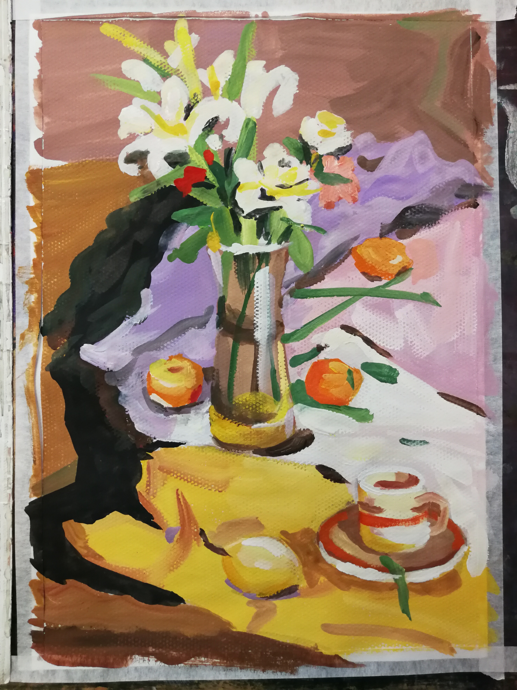
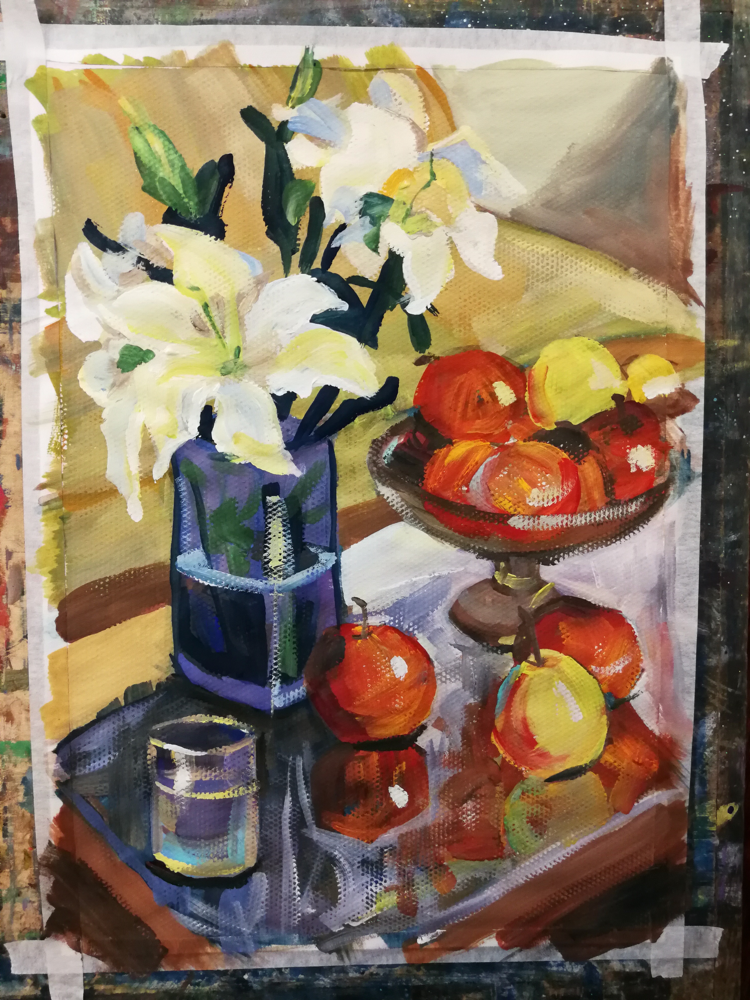

Over the years, I developed quite a few hobbies to keep myself entertained. 

I started learning fine arts (sketching objects and figures, painting) since I was in primary school. During grad school, I got into urban sketching, where you take your sketchbook anywhere and depict the scenes. I joined the urban sketching group in Toronto once. It was a blast! 

### Sketching

<!-- 
*sketching street scene, ref Martin Lewis.* -->
<figure>
    
    <figcaption>sketching street scene, ref Martin Lewis.</figcaption>
</figure>

*travel sketch, a train station in Kyoto, Japan*

### Painting

*water color painting*

*water color painting*

### Photography

